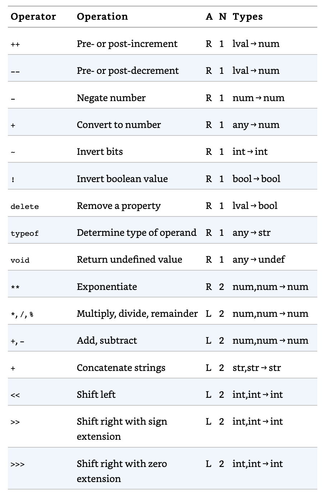
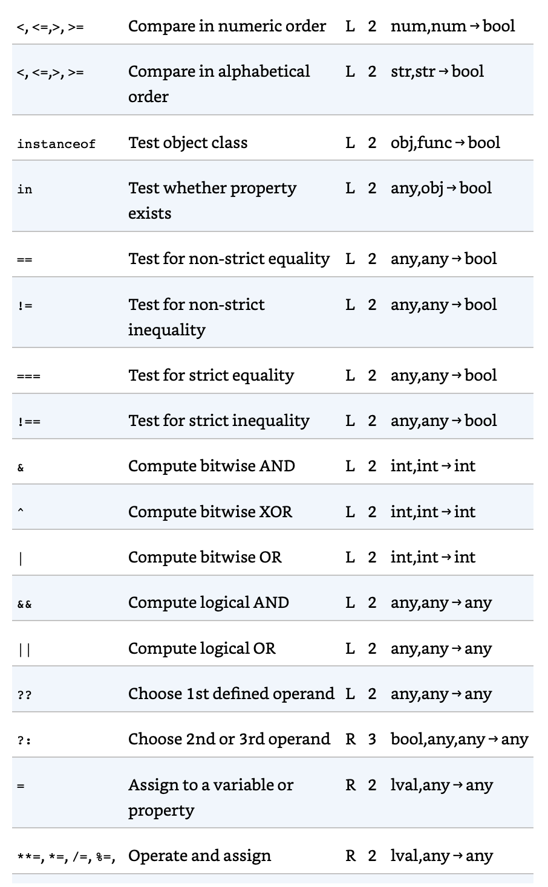
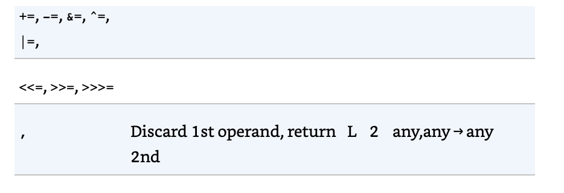
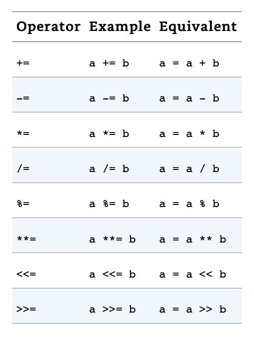
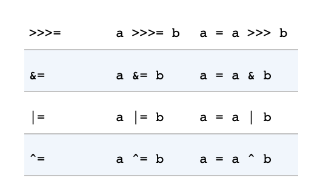

# Expresiones y operadores

Una expresión es una frase de JS que puede ser evaluada para producir un valor. Una constante incluida literalmente en tu programa es una forma muy simple de expresión. El nombre de una variable es otra expresión simple que evalua a lo que quiera que el valor de dicha variable tenga asignado. Las expresiones mas complejas vienen de construirlas con expresiones simples.

La expresión de acceso a un array, pro ejemplo, consiste en una expresión que evalua el array, seguido de la apertura de corchetes, una expresión que evalua enteros y el cierre de corchete. Esta expresión compleja evalua al acceso de un index especificado de un array especificado: `a[1]`.

De la misma manera ocurre con las invocaciones de las funciones, que son expresiones compuestas por la evaluación de un objeto función y uno o mas expresiones adicionales que son los argumentos de la función: `foo(1)`.

La manera más comun de construir expresiones complejas fuera de las expresiones simples es con un operador. Un operador combina valores de sus operandos de alguna manera y evalua a un nuevo valor. La multiplicación y su operador `*` es un ejemplo. La expresión `x * y` evalua el producto de los valores de la expresión `x` e `y`. Por simplicidad solemos decir que un operador retorna el valor en vez de que lo evalua.

## Expresiones primarias

La forma más simple de expresiones, conocidas como expresiones primarias, son aquellas que están solas, no incluyen ninguna expresión simple. Las expresiones primarias en JS son constantes, o valores literales, algunas palabras claves del lenguaje y referencias a variables.

Los literales son valores constantes que son embebidos directamente en el software:

```js
1.43
"hello"
/pattern/
```

Algunas palabras reservadas de JS son expresiones primarias:

```js
true;
false;
null;
this;
```

A diferencia de las otras palabras clave, `this`no es constante, evalua diferente valores en diferentes puntos del software. La palabra clave `this`es usada en programación orientada a objetos. Junto al cuerpo de un método, `this` retorna o evalua el objeto del cual el método ha sido invocado.

Finalmente, la tercera forma de expresiones primarias es una referencia a las variables, constantes o propiedades del objeto global:

```js
i; // una variable i
undefined; // el valor undefined del propiedad del objeto global
```

Cuando cualquier identificador aparece por si ismo en un programa, JS asume que es una variable, constante o propiedad del objeto global y busca su valor. Si ninguna variable con dicho nombre existe, el intento de evaluar una variable inexistente lanza un error `ReferenceError` a cambio.

## Inicializadores de objetos y arrays

Los inicializadores de objetos y arrays son expresiones cuyo valor es un nuevo objeto o array. Estas expresiones de inicialización son llamadas literales de objetos o literales de arrays. A diferencia de los verdaderos literales, no son expresiones primarias porque incluyen un número de subexpresiones que especifican propiedades y valores de elementos. Los inicializadores de array tienen una sintaxis un poco más simple que la de objetos.

Un inicializador de array es una lista separada por comas de expesiones contenidas entre corchetes. El valor de un inicializador de array es un array recién creado. Los elementos de este nuevo array son inicializados a los valores de las expresiones separadas por coma:

```js
[]; // un array vacío sin expresiones dentro, por lo que sin elementos
[1 + 2, 3 + 4]; // Un array de 2 elementos. El primer elemento es 3 y el segundo 7
```

Las expresiones de los elementos en el inicializador de array pueden ser ellas mismas inicializadores de arrays, lo cual signifíca que dichas expresiones pueden crear arrays anidados:

```js
const matrix = [
  [1, 2, 3],
  [4, 5, 6],
  [7, 8, 9],
];
```

Las expresiones de elementos en un inicializador de array son evaluadas cada vez que el inicializador de array es evaluado. Esto significa que el valor de una expresión inicializadora de un array puede ser diferente cada vez que esta se evalua.

Los elementos `undefined`, pueden ser incluidos en un literal de array, simplemente omitiendo un valor entre comas:

```js
const sparseArr = [1, , , , 5]; // Un array de 5 elementos, incluyendo 3 elementos undefined
```

Una coma final está permitida después de la última expresion de un inicializador de array y no creara un elemento `undefined`. Pero cualquier expresión de acceso al array para un index que venga después de la última expresión que este contiene, necesariamente sera evaluada a `undefined`.

Las expresiones inicializadoras de objetos son como las de array, pero los corchetes son reemplazados por llaves y cada subexpresión es prefijada por un nombre de propiedad y un colon `:`:

```js
const p = { x: 2.3, y: -1.2 }; // Un objeto con dos propiedades
const q = {}; // Un objeto vacío, sin propiedades

q.x = 2.3;
q.y = -1.2; // Ahora q tiene las mismas propiedades que p
```

Los literales de objetos, pueden ser anidados:

```js
const rectangle = {
  upperLeft: { x: 2, y: 2 },
  lowerRight: { x: 4, y: 4 },
};
```

## Expresiones de definicion de funciones

Una expresión de definición de una función, define una función de JS y el valor de dicha expresión es la nueva función definida. De alguna manera, podemos entender estas expresiones como el literal de una función, de la misma manera que el literal de un objeto es una expresión inicializadora de un objeto.

Una expresión de definición de función normalmente consiste en la palabra clave `function` seguida de una lista separada por comas de cero o más identificadores (los nombres de los parámetros) entre paréntesis y un bloque de código JS (el cuerpo de la función) entre llaves:

```js
const square = function (x) {
  return x * x;
};
```

La expresión de definición de una función puede también incluir un nombre para dicha función. Las funciones pueden ser definidas también usando un estamento de función en vez de una expresión de función. En ES6, las expresiones de función pueden usar una nueva forma compacta llamada sintaxis de "arrow function".

## Expresiones de acceso a de propiedades

Una expresión de acceso a propiedad evalua el valor de una propiedad de un objeto o un elemento de array. JS define dos sintaxis para acceder a una propiedad:

```txt
expresión . identificador
expresión [ expresión ]
```

El primer estilo de acceso a propiedad es una expresión seguida por un periodo y un identificador. La expresión especifica el objeto, y el identificado especifica e lnombre de la propiedad deseada.

El segundo estilo de acceso a propiedad sigue a la primera expresión (objeto u array) con otra expresión entre corchetes. La segunda expresión especifica el nombre de la propiedad deseada o el index del elemento deseado en el array.

```js
const o = { x: 1, y: { z: 3 } };
const a = [o, 4, [5, 6]]; // un array que contiene el objeto anterior

o.x; // => 1: propiedad x de la expresión o
o.y.z; // => 3: propiedad z de la expresión o.y
o["x"]; // => 1: propiedad x del objeto o
a[1]; // => 4: elemento del index 1 de la expresión a
a[2]["1"]; // => 6: elemento del index 1 de la expresión a[2]
a[0].x; // => 1: propiedad x de la expresión a[0]
```

Cuando cualquiera de los tipos de acceso a propiedad, es evaluado. Si el valor es `null` o `undefined`, la expresión lanza un error `TypeError`, dado que estos son valores de JS que no tienen propiedades.

Si la expresión de objeto es seguida de un punto y un identificador, el valor de la propiedad nombrada por el identificador es buscado y viene a ser el valor de la expresión total.

Si la expresión de objeto es seguida de otra expresión entre corchetes, la segunda expresión es evaluada y convertida a string. El valor total de la expresión es entonces el valor de la propiedad cuyo nombre tiene ese string. En ambos casos si la propiedad nombrada no existe, entonces el valor de la expresión de acceso a la propiedad es `undefined`.

### Acceso condicional a propiedades

TODO: IMPLEMENTAR

## Expresiones de invocación

Una expresión de invocación de JS, es la sintaxis que tenemos para ejecutar un método o funcion. Empieza con la expresión de una función que identifica la función que desea ser llamada. La expresión de función es seguida por la apertura de parentesis, una lista separada por comas de cero o mas expresiones de argumentos, y el cierre de parentesis:

```js
f(0);
Math.max(x, y, z);
a.sort();
```

Cuando una expresión de invocación es evaluada, la expresión de la función es lo primero que se evalua, luego las expresiones de los argumentos, para producir una lista de valores. Si el valor de la expresión de la función no es una función, un error `TypeError` es lanzado. Seguido, los valores de los argumentos son asignados, en orden, al nombre de los parametros especificados cuando la función fue definida, y el cuerpo de la función es ejecutado. Si la función usa el estamento `return` para retornar un valor, entonces el valor viene a ser el valor de la invocación de la función. De otra manera, el valor de la expresión de invocación es `undefined`.

Cada expresuón de invocación incluye un par de parentesis y una expresión antes de su apertura. Si la expresión es una expresión de acceso a propiedad, entonces la invocación es conocida como metodo de invocación. En los métodos de invocación los objetos o arrays de los la propiedad a la que se accede son parte, viene a tomar el valor del valor `this` cuando el cuerpo de la función es ejecutado. Esto habilita la programación orientada a objetos en JS, donde las funciones (metodos), operan en el objeto del que pertenecen.

Aunque la sintaxis `.identifier`es la más simple de las dos opciones de acceso, ten en cuenta que solo puede ser usada cuando la propiedad a la que quieres tener acceso tiene un identificador legal, y existe. Si el nombre propiedad incluye espacios o caracteres de puntuacion, o es un numero, entonces debes usar la propiedad por corchetes. La sintaxis de acceso por corchetes tambien es util si el nombre de la propiedad no es estatico, sino resultado de otro calculo.

### Invocación condicional

TODO: IMPLEMENTAR

## Expresiones de creacion de objetos

Una expresión de creación de un objeto, crea un nuevo objeto e invoca una función, llamada constructor, para inicializar las propiedades de dicho objeto. Las expresiones de creacion de objetos son como las de invocación, a excepción de que van prefijadas con la palabra reservada `new`:

```js
new Object();
new Point(2, 3);
```

Si ningun argumento es pasado a la función de construccion durante la expresión de creacion del objeto, el par par entero de parentesis puede ser omitido:

```
new Object;
new Date;
```

La evaluación de estas expresiones en un nuevo objeto creado.

## Operadores

Los operadores se utilizan para las expresiones aritméticas de JavaScript, comparación expresiones, expresiones lógicas, expresiones de asignación...

La mayoría de los operadores están representados por caracteres como `+` y `=`. Algunos, sin embargo, están representados por palabras clave `delete` y `instanceof`. Los operadores de palabras clave son operadores regulares, como los de puntuacion, pero tienen una sintaxis más textual.

La siguiente lista, está ordenada por la precedencia de los operadores. Y direccion de la evaluación (derecha a izquierda o izquierda a derecha):





### Numero de operandos

Los operadores pueden ser categorizados basados en el número de operandos que esperan, su aridad. La mayoría de operadores JS, como el operador de multiplicación `*`, son operadores binarios que combinan dos expresiones en una sola más compleja. Es decir, esperan dos operandos. JS también soporta un numero de operadores unarios, los cuales convierten una unica expresión en otra más compleja. El operador `-` en la expresión `-x` es un operador unario que realiza la operación de negación en el operando x. Finalmente, JS soporta el operador ternario u operador condicional `?:`, el cual combina tres expresiones en una sola.

### Operandos y tipo de resultados

Algunos operadores trabajan sobre valores de cualquier tipo, pero la mayoría esperan que sus operandos sean de un tipo específico y la mayoría retornan (o evaluan) a un tipo específico.

Los operadores JS normalmente convierten el tipo de sus operandos segun lo necesitan. El operador de multiplicación `*` espera operandos numericos, pero la expresión `"3" * 5` es egal porque JS puede convertir los operandos a números. El valor de dicha expresión es el número 15, no el string `"15"`. Recuerda que todos los valores JS son ciertos o falsos, por lo que un operador que espera operandos booleanos puede trabajar con operandos de cualquier tipo.

Algunos operadores se comportan de manera diferente dependiendo del tipo de operandos que se usan con ellos. El más remarcable, el operador `+` suma operandos numericos pero concatena operandos de tipo string. De manera similar, el operador de comparación como `<` realiza una comparación numérica o de orden alfabetico dependiendo del tipo de operandos.

### Operadores y sus efectos secundarios

Evaluar una expresión simple como `2 * 3` nunca afecta al estado de tu programa, y cualquier futuro cálculo de tu programa no sera afectado por dicha evaluación. Algunas expresiones, sin embargo, tienen efectos secundarios y su evaluación afecta al resultado de futuras evaluaciones. El operador de asignación es el ejemplo más obvio: si asignas un valor a una variable o propiedad, eso cambia el valor de cualquier expresión que use dicha variable o propiedad.

Los operadores de incremento `++` y decremento `--` son similares, dado que realizan una asignación de manera implicita. El operador `delete` también tiene efectos secundarios: borrar una propiedad es como asignar `undefined` a la propiedad.

Ningún otro operador de JS tiene efectos secundarios, pero las expresiones de creación de un objeto o invocacación de una función pueden tener efectos secundarios si alguno de los operadores usados en la función o en el cuerpo del constructor del objeto tienen efectos secundarios.

### Precedencia de operadores

La precedencia de los operadores controla el orden en el que las operaciones son realizadas. Operaciones con mayor precedencia son realizadas antes que aquellos que tienen una menor, por ejemplo:

```js
const w = x + y * z;
```

El operador de multiplicación `*` tiene un orden de precedencia mayor que el del operador de suma `+`, por lo que la multiplicación se realiza antes que la suma. De hecho el operador `=` es el que menos precedencia tiene, asique la asignación se producirá después de que todas las operaciones a su lado derecho sean completadas.

La precedencia de los operadores puede ser sobreescrita con el uso explícito de paréntesis. Para forzar la suma a ser evaluada primero, en el anterior ejemplo, escribimos:

```js
const w = (x + y) * z;
```

El acceso a propiedades o las invocaciones tienen mayor precedencia que cualquier operador de la tabla:

```js
/*
  mis es un objeto con una propiedad llamada funciones cuyo valor es un array de funciones.
  Invocamos la funcion de numero x, pasandole un argumento y, luego preguntamos por el tipo del valor retornado
*/
typeof mis.funciones[x](y);
```

Anque `typeof`es uno de los operadores con mayor prioridad, su operación es realizada en el resultado del acceso a la propiedad, el index del array y la invocación de la función, que tienen mayor precedencia todos que cualquier operador.

En la práctica, si no estas seguro de la precedencia de tu operador, la más simple que puedes hacer es usar paréntesis para hacer el orden de evaluación explícito. Las reglas importantes a conocer es que: la multiplicación y división son realizadas antes que la suma y la resta, y las asignaciones tienen una precedencia muy baja y en casi todos los casos son realizadas las últimas.

Cuando operadores nuevos son incluidos en JS, no siempre se ajustan a este esquema de precedencias y debemos usar de manera explícita paréntesis si se mezclan. Por ejemplo, el operador de exponenciación `**` no tiene una precedencia bien definida con el operador unario de negación `!`, y debes usar parentesis cuando combinas negación y exponenciación.

### Asociatividad de operadores

La asociatividad de un operador especifica el orden en el cual las operaciones de misma precedencia son realizadas. Una asociatividad de izquierda a derecha significa que las operaciones son realizadas en esa dirección. Por ejemplo, el operador de resta, tiene este tipo de asociatividad:

```text
const w = x - y - z;
// es lo mismo que:
const w = ((x - y) - z)
```

### Orden de evaluación

La precedencia y la asociatividad especifican el orden en el que las operaciones son realizadas en una expresión compleja, pero no especifican el orden en el cual las subexpresiones son evaluadas. JS siempre evalua las expresiones de manera estricta de izquierda a derecha. En la expresión `w = x + y * z`, la subexpresión `w` es evaluada primero, seguido de `x`, `y` y `z`. Luego los valores de `y` y `z` son multiplicados, añadidos al valor de `x` y asignados a la variable o propiedad especificada por la expresión `w`. Añadir paréntesis a las expresiones cambia el orden relativo de la multiplicación, adición y asignación, pero no el orden de evaluación de izquierda a derecha.

El orden de evaluación solo marca la diferencia si algunas de las expresiones que son evaluadas tienen efectos secundarios que afectan al valor de otra de las expresiones. Si la expresion `x` incrementase la variable que es usada por la expresión `z`, entonces el hecho de que `x` sería evaluada antes que `z` es importante.

## Expresiones aritméticas

La mayoría de operadores aritméticos pueden ser usados con operandos de tipo `BigInt` o con numeros normales, siempre que no mezclemos ambos tipos.

Los operadores aritméticos básicos son: `**` (exponenciación), `*` (multiplicación), `/` (división), `%`(módulo: el resto después de una divisón), `+` (suma o adición), `-` (resta o substracción). Quitando el caso especial del operador de suma `+`, todos los operadores evaluan sus operandos, convirtiendo los valores a nçumeros si es necesario y calculando la potencia, producto, cociente, resto o diferencia. Los operandos no numéricos que no pueden ser convertidos a números, convierten al valor `NaN`. Si cualquier operando es o convierte a `NaN`, el resultado de la operación, casi siempre, es `NaN`.

El operador `**` tiene una precedencia más alta que `*`, `/` y `%` (los cuales ya tiene mayor precedencia que `+` y `-`). A diferencia de otros operadores, `**` funciona de derecha a izquierda, por lo que `2**2**3` es lo mismo que `2**8`, no `2**4`. Existe una amigüedad natural en expresiones como `-3**2`. Dependiendo de la precedencia relativa del operador unario `-` y la exponenciación (`**`), esa expresión puede significar `(-3)**2` o `-(3**2)`. Cada lenguaje maneja esto de manera diferente, JS te lanzará un error de sintaxis si omitimos los paréntesis en este caso, obligandote a desambiguar la expresión.

`**` es el último de los operadores, añadido en ES6. La función `Math.pow()` estaba disponible desde las primeras versiones de JS, pero realiza la misma operación que el operador `**`.

El operador `/` divide su primer operando entre el segundo. En JS todos los números son de punto flotante, por lo que todas las operaciones de división tienen un resultado de punto flotante: `5/2` evalua a `2.5` no a `2`. Las divisiones por cero producen `Infinity` positivos o negativos, mientras que `0/0` evalua a `NaN`, en ningun de ambos casos se lanza un error.

El operador `%` calcula el resto después de la división del primer operando entre el segundo operando. El signo del resultado es el mismo que el del primer operando: `5 % 2` evalua a `1` y `-5 % 2` evalua a `-1.`. Aunque normalmente es usado con operandos que son enteros, tambien funciona con números reales.

### El operador +

El operador binario `+` suma operandos numéricos o concatena operandos strings.

```js
1 + 2; // => 3
"hello" + " " + "world"; // => "hello world"
"1" + "2"; // => "12"
```

Cuando los valores de ambos operandos son números, o ambos son strings, entonces es obvio lo que el operador `+` hace. Pero hay casos en los que la conversión del tipo se hace necesaria y la operación a realizar depende de la conversión realizada. las reglas de conversión para `+` dan prioridad a la concatenación de strings: si cualquier operando es un string o un objeto que convierte a string, el otro operando es convertido a string y se realiza una concatenación de los mismos. La suma solo es realizada si ninguno de los operandos son strings.

Técnicamente el operador `+` funciona así:

- Si alguno de los valores de los opreandos es un objeto, este convierte a primitivo usando el algoritmo de objeto-a-primitivo. Objetos `Date` son convertidos usando su método `toString()`, y todos los demás objetos son convertidos via `valueOf()` si dicho método retorna un valor primitivo. Como muchos objetos no tienen un método `valueOf()`, suelen ser convertidos usando `toString()` también.
- Después de la conversión a de objeto-a-primitivo, si cualquier operando es un string, el otro operando es convertido a string y se realiza la concatenación.
- De otra manera, ambos operandos son convertidos a números o `NaN` y se realiza la suma.

```js
1 + 2; // => 3: suma
"1" + "2"; // => "12": concatenación
"1" + 2; // => "12": concatenación después de convertir número-a-string
1 + {}; // => "1[object Object]": concatenacion después de convertir objeto-a-string
true + true; // => 2: suma después de convertir booleano-a-número
2 + null; // => 2: suma después de convertir null a 0
2 + undefined; // => NaN: suma tras convertir undefined a NaN
```

Es importante destacar que cuando el operador `+` es usado con strings y números, puede no ser asociativo. Esto significa que el resultado puede depender del orden en el que las operaciones son realizadas:

```js
1 + 2 + " hello world"; // => "3 hello world"
1 + (2 + " hello world"); // => "12 hello world"
```

La primera línea no tiene paréntesis y el operador `+` tiene una asociatividad de izquierda a derecha, por lo que los números son sumados primero y la suma es concatenada al string.
En la segunda línea los paréntesis alteran el orden de las operaciones: el número 2 es concatenado con el string, produciendo un nuevo string. Luego el número 1 es concatenado con el nuevo string produciendo el string final.

### Operadores aritméticos unarios

Los operadores unarios modifican el valor de un único operando para producir nun nuevo valor. En JS, todos los operadores unarios tienen una alta precedencia y son asociativos de derecha a izquierda. Los siguientes operadores aritméticos unarios (`+`, `-`, `++` y `--`) convierten su único operando a un número si es necesario. Destacar que los caracteres `+` y `-` pueden usarse de operadores unarios o binarios.

- _Unario más (`+`)_: El operador unario más convierte su operando a un número o `NaN`y retorna el valor convertido. Cuando es usado con un operando que ya es un número, este no hace nada, por ejemplo: `+3`. Este operador no puede ser usado con valores de tipo `BigInt` dado que estos no convierten a números regulares.
- _Unario menos (`-`)_: Cuando `-` es usado como operador unario, este convierte su operando a un número si es necesario y después cambia el signo del resultado.
- _Incremento (`++`)_: El operador `++` incrementa su operando, por ejemplo añade 1, el cual debe ser una variable, un elemento de un array o la propiedad de un objeto.
  El operador convierte su operando a número, añade 1 al número y asigna el valor incrementado de vuelta a la variable, elemento o propiedad.
  El valor retornado por el operador `++` depende de su posición relativa en el operando.

  - Cuando es usado antes del operando, conocido como operador preincremental, entonces incrementa el operando y devuelve el valor incrementado del operando.
  - Cuando es usado después del operando, es conocido como operador postincremental, entocnes incrementa el operando pero devuelve el valor antes del incremento del operando:

    ```js
    const i = 1;
    const j = ++i; // i y j tienen un valor de 2 ambos

    const n = 1;
    const m = n++; // n vale 2 y m vale 1
    ```

  Destacar que la expresión `x++` no significa siempre lo mismo que `x = x + 1`. El operador `++` nunca realiza concatenación de strings: siempre convierte su operando a un número y lo incrementa. Si `x` es el string `"1"`, `++x` es el número `2`, pero `x+1` es el string `"11"`.

  También destacar que como JS inserta de manera automática un semicolon, no vas a poder insertar un salto de línea despues del operador de incremento y el operando que le precede. Si lo haces, JS tratará el operando como un estamento nuevo e insertará un semicolon antes de él.

  Tanto la forma pre, como la post incremental, son muy usadas para incrementar el contador que con controla un loop `for`.

- _Decremento (`--`)_: El operador `--` expera un valor que sea una variable, un elemento de un array o una propiedad de un objeto. Convierte el valor del operando a número, resta 1, y asigna el valor decrementado al operando. Al igual que el operador `++`, el valor retornado por `--` depende de su posición relativa en el operando. Cuando es usado antes del operando, decrementa el valor y lo retorna. Cuando es usado depués del operando, decrementa el valor y devuelve el valor antes del decremento. Tampoco permite saltos de línea entre el operando y su operador.

### Operadores Bitwise

TODO: POR IMPLEMENTAR

## Expresiones relacionales

Estos operadores testean las relaciones (tal como "igual", "menos que" o "propiedad de") entre dos valores y retornan `true` o `false` dependiendo de si dicha relación existe. Las expresiones relacionales siempre evaluan a un valor booleano, y dicho valor es usado, normalmente, como control del flujo de ejecucuón en los estamentos `if`, `while` y `for`.

### Operadores de igualdad e inegualdad

Los operadores `==` y `===` comprueban cuando dos valores son los mismos, usando dos diferentes definiciones para la igualdad. Ambos operadores aceptan operandos de cualquier tipo, y ambos retornan `true`si sus oprandos son los mismos y `false` si son diferentes.

El operador `===` es conocido como el **operador de igualdad estricta** (u operador de identidad), y comprueba cuando dos valores son **identicos** usando una definición estricta de igualdad.

El operador `==` es conocido como el **operador de igualdad** y comprueba que dos valores son **iguales** usando una definición más laxa de igualdad que permite la conversión de tipos.

Los operadores `!=` y `!==` son lo opuestos de `==` y `===`.

El operador de inegualdad `!=` devuelve `false` si dos valores son iguales el uno al otro segun las normas de `==` y retorna `true` en caso contrario.

El operador de inegualdad estricta `!==` devuelve `false` si dos valores son identicos el uno al otro segun las normas de `===` y retorna `true` en caso contrario.

_El operador `!` calcula la operación booleana NOT. Esto hace facil de recordar que los operadores de inegualdad significan algo asi como: "no es igual", "no es estrictamente igual"._

Ya mencionamos que JS compara los objetos por referencia, no por valor. Un objeto es igual a si mismo, pero no a otro objeto. Un objeto será diferente a otro aunque tengan las mismas propiedades y métodos. Lo mismo ocurren con los arrays que tengan los mismos elementos en el mismo orden, no serán iguales entre si, si no es por referencia.

#### Igualdad estricta

El operador de igualdad estricta `===` evalua sus operandos, luego compara los dos valores sin realizar ninguna conversión de tipos, de la siguiente manera:

- Si los dos valores tienen diferente tipo, no son iguales.
- Si ambos valores son `null` o ambos son `undefined`, entonces son iguales.
- Si ambos valores son el valor booleano `true` o ambos son el valor booleano `false`, entonces son iguales.
- Si uno o ambos valores es `NaN`, entonces no son iguales. (`NaN` nunca es igual a otro valor, ni siquiera así mismo, recuerda que debemos usar `isNaN()` si quieres comprobar explicitamente si un valor es `NaN`).
- Si ambos valores son números y tienen el mismo valor, entonces son iguales. A excepción de un caso, `0 === -0` son iguales para JS.
- Si dos valores son strings y contienen los mismos valores de 16-bit, en la misma posición, entonces son iguales. JS no realiza normalización Unicode y si varían en contenido o longitud, no serán iguales.
- Si dos valores se refieren al mismo objeto, array o función, entonces son iguales.

#### Igualdad con conversión de tipo (no estricta)

El operador de igualdad `==` es como el de igualdad estricta, pero un poquito más laxo. Si los valores de los dos operandos no son del mismo tipo, intentará realizar una conversión de tipos y luego compararlos de nuevo:

- Si dos valores tienen el mismo tipo, comparará de manera estructa entre ellos.
- Si dos valores no son del mismo tipo, el operador `==` podría considerarlos iguales. Siguiendo las siguientes reglas y conversiones de tipo para comprobar la igualdad:

  - Si un valor es `null` y el otro es `undefined`, entonces son iguales
  - Si un valor es un número y el otro es un string, convierte el string a número e intenta la comparación de nuevo, usando el valor convertido.
  - Si ambos valores son `true`, los convierte a `1` e intenta la comparación de nuevo.
  - Si ambos valores son `false`, los convierte a `0` e intenta la comparación de nuevo.
  - Si un valor es un objeto y el otro es un número o string, convertira el objeto a primitivo, usando bien el método `toString()` del mismo o `valueOf()`. Cualquier clase del core de JS primero intentará usar `valueOf()` para la conversión y luego `toString()`, a excepción de los `Date` que siempre usan `toString()`.

  Cualquier otra combinación de valores, será considerada como "no igual".

Ejemplo:

```js
"1" === true; // => true
```

La expresión evalua a `true`, indicando que esos dos valores tan diferentes son de hecho iguales. El valor booleano `true` ha sido convertido al número `1` y luego se realiza la comparación de nuevo. Luego se convierte el sring `"1"` al número `1`. Como ambos valores son el mismo, la comparación devuelve `true`.

### Operadores de comparación

Los operadores de comparación preban el orden relativo, numérico o alfabético, de sus dos operandos:

- _Menor que `<`_: El operador `<` evalua a `true` si su primer operando es menor que el segundo, de otra manera, evalua `false`.
- _Mayor que `<`_: El operador `>` evalua a `true` si su primer operando es mayor que el segundo, de otra manera, evalua `false`.
- _Menor o igual que `<=`_: El operador `<=` evalua a `true` si su primer operando es menor o igual que el segundo, de otra manera, evalua `false`.
- _Mayor que `<`_: El operador `>=` evalua a `true` si su primer operando es mayor o igual que el segundo, de otra manera, evalua `false`.

Los operandos de estos comparadores pueden ser de cualquier tipo. La comparación es realizada solo sobre números o strings, pero si son de diferente tipos a números o strings entonces son convertidos.

La comparación y conversión sigue las siguientes reglas:

- Si cualquier operando evalua a un objeto, entonces el objeto se convierte a un valor primitivo. Si su método `valueOf()` retorna un valor primitivo, el valor es usado. Sino utilizará el valor que retorne su método `toString()`.
- Si después de realizar una conversión, ambos operandos son strings, los dos strings son comparados usando orden alfabético. Donde dicho orden es definido por el orden numérico de 16-bit de los valores Unicode que componen los strings.
- Si después de realizar la conversión, al menos uno de los operandos no es un string, ambos operandos son convertidos a números y comparados numéricamente. `0` y `-0` son considerados igales. `Infinity` es más grande que cualquier número que no sea el mismo y `-Infinity` es considerado más pequeño que cualquier número que no sea el mismo. Aunque los operadores aritméticos no permiten mezclar valores de `BigInt` con número regulares, pero los operadores de comparación como estos si.

Recuerda que en JS los strings son secuencias de 16-bit de valores enteros, y una comparación de sdtrings es realmente una comparación numérica de valores entre los dos strings. El orden de codificación numérica definido por Unicode puede no casar con el orden de nuestro lenguaje. Además la comparación de strings es sensible a las mayúsculas y minúsculas, y todas las letras en mayúsculas son menores que las letras en minúsculas.

```js
"zoo" < "Alba"; // => true
```

Para una comparación más robusta, podemos usar el método `String.localeCompare()`, que tiene encuenta definiciones alfabéticas dentro del idioma del navegador. Para comparaciones que no deseemos que sean sensibles a las mayúsculas o minúsculas, podemos convertir todos los strings a uno de los dos tipos con `String.toUpperCase()` o `String.toLowerCase()`. Para algo más localizado podemos usar la clase `Intl.Collator`.

Ambos, el operador `+` y los operadores de comparación trabajan diferente entre strings y números. `+` prefiere los strings, realizando la concatenación si ambos operandos son strings. Los operadores de comparación prefieren los nùmeros y solo realizan comparaciones entre strings si ambos lo son:

```js
1 + 2; // => 3: suma
"1" + "2"; // => "12": concatenacion
"1" + 2; // => "12": concatenacion tran convertir 2 en "2"
11 < 3; // => false: comparacion numérica
"11" < "3"; // => true: comparacion de strings
"11" < 3; // => false: comparacion numérica, "11" es convertido a 11
"one" < 3; // => false: comparación numérica, "one" es convertido a NaN
```

Además, destacar que `<=` y `>=` no usan la igualdad o igualdad estricta para determinar cuando dos valores son iguales. En vez de eso, el operador _menor o igual que_ es simplemente definido como _no más grande que_ y el operador _mayor o igual que_ se define como _no es menor que_. La única excepcion se dá cuando algun operando es o convierte a `NaN`, en ese caso cualquiera de las cuatro comparaciones retornara `false`.

### Operador: in

El operador `in` espera que el operando de su izquierda sea un string, símbolo o valor que pueda ser convertido a un string. Y espera que el operando de su lado derecho sea un objeto. Evalua `true` si el valor del lado izquierdo es el nombre de una propiedad del objeto de su lado derecho:

```js
const p = { x: 1, y: 1 };
"x" in p; // => true: el objeto tiene una propiedad llamada "x"
"z" in p; // => false: el objeto no tiene una propiedad llamada "z"
"toString" in p; // => true: todo objeto hereda un método llamada toString

const arr = [7, 8, 9];
"0" in arr; // => true: existe el index
1 in arr; // => true: el numero es convertido a string
3 in arr; // => false: no existe dicho index
```

### Operador: instanceof

El operador `instanceof` espera que el operando de su lado izquierdo sea un objeto y el del lado derecho una clase que identifique al objeto. El operado evalua a `true` si el objeto del lado izquierdo es una instancia de la clase del lado derecho y evalua a false en caso contrario.

```js
const d = new Date();
d instanceof Date; // => true: d es una instancia de Date
d instanceof Object; // => true: todos los objetos son instancias de Object
d instanceof Number; // => false: d no es un objeto Number

const a = [1, 2, 3];
a instanceof Array; // => true: a es un array
a instanceof Object; // => true: todos los arrays son instancias de Object
a instanceof RegExp; // => false: los arrays no son expresiones regulares
```

Destacar que todos los objetos son instancias de `Object`. `instanceof` considera las superclases cuando decide si un objeto es una instancia de una clase. Si el operando del lado izquierdo de `instanceof` no es un objeto, entonces retorna `false`. Si el del lado derecho no es una clase de objetos, entonces lanzará un error `TypeError`.

Para entender como funciona el operador `instanceof` hay que entender la cadena de prototipos en JS. Suscitamente, para evaluar la expresión `o instanceof f` JS evalua `f.prototype` y luego busca ese valor en la cadena de prototipos de `o`. Si lo encuentra entonces `o` es instancia de `f`, o una subclase y el operador retorna `true`. En caso contrario retorna `false`.

## Expresiones lógicas

Los operadores lógicos `&&`, `||` y `!` realizan algebra booleanay son usados normalmente con los operadores relacionales para combinar dos expresiones relacionales en una más compleja.

### AND (&&)

El operador `&&` puede ser entendido en tres niveles diferentes. En su nivel más simple, cuando es usado con operandos booleanos, `&&` realiza la operación booleana AND en los dos valores: retorna `true` si y sólo si el primero operando y el segundo operando son `true`. Si alguno de sus operandos es `false`, retornará `false`.

`&&` es usado a menudo como conjunción para unir dos expresiones relacionales:

```js
x === 0 && y === 0; // true si y solo si x e y son igual a 0
```

Las expresiones relacionales siempre evaluan a `true` o `false`, entonces cuando son usadas así, el operador `&&` en si mismo retorna `true` o `false`. Los operadores relacionales tienen mayor precedencia que los lógicos, por lo que las expresiones como la anterior pueden ser escritar de manera segura sin paréntesis.

Pero `&&` no requiere que sus operandos sean valores booleanos. Recuerda que todos los valores JS son ciertos o falsos. El segundo nivel al que `&&` puede ser entendido es como operador booleano AND para valores ciertos o falsos. Si ambos operandos son ciertos, el operador retorna un valor cierto. De la otra manera, si ambos operandos son falsos, el operador retorna un valor falso. En JS cualquier expresión o estamento que espera un valor booleano puede trabajar con valores ciertos o falsos, por lo que el hecho de que `&&` no siempre retorne `true` o `false` no causa problemas prácticos.

Hemos dicho que el operador retorna un valor cierto o falso, pero no qué valor es. Para eso, necesitamos describir el tercer nivel de `&&`. Este operador empieza evaluando su primer operando, la expresión a si izquierda. Si el valor a su izquierda es falso, el valor de la expresión entera será falso, entonces `&&` simplemente retorna el valor de si izquierda y no llega a evaluar la expresión de su derecha.

Por otro lado, si el valor de su izquierda fuera cierto, toda el valor de la expresión depende del valor de su lado derecho. Si el valor del lado derecho es cierto, entonces todo el valor de la expresión sera cierto, y si fuera falso entonces todo el valor de la expresión sería falso. Entonces cuando el valor de su operando izquierdo es cierto, `&&` evalua y devuelve el valor de su derecha:

```js
const o = { x: 1 };
const p = null;
o && o.x; // => 1: o es cierto entonces retorna o.x
p && p.x; // => null: p es falso, entonces lo retorna y no evalua p.x
```

Es importante entender que `&&` puede o no puede evaluar el operando de su lado derecho. Este comportamiento de `&&` es conocido como cortocircuito, y podemos explotar ese comportamiento para ejecutar código de manera condicional:

```js
if (a === b) stop();
a === b && stop();
```

En general, debes tener cuidado cuando escribamos expresiones con efectos secundarios en el lado derecho de `&&`. El que esos efectos ocurran dependerán del valor del lado izquierdo.

### OR (||)

El operador `||` realiza la operación booleana OR en los dos operandos. Si uno de los dos operandos es cierto, entonces retorna un valor cierto. Si ambos operandos son falsos, retorna un valor falso.

Aunque el operador `||` es comunmente usado como operador booleano OR, y como el operador `&&`, tiene un comportamiento algo más complejo. Empieza evaluando su primer operando, la expresión de su izquierda. Si el valor del primer operando es cierto, cortocircuita y retorna dicho valor cierto sin siquiera evaluar la expresión de su derecha. Por otro lado, si el valor del primer operando es falso, `||` evalua el segundo operando y retorna el valor de dicha expresión.

Tal como hacemos con el operador `&&`, deberíamos evitar operandos del lado derecho que incluyan efectos secundarios, a menos que tu proposito sea usar este comportamiento.

Un uso común de este operador es seleccionar el primer valor cierto en un conjunto de alternativas:

```js
// seleccion del primero que sea cierto
const max = maxWdith || preferences.maxWidth || 300;
```

**Cuidado!**, porque aunque `0` es un valor legal, el anterior código no funcionaría dado que `0` es un valor falso. Como alternativa en estos casos puede usarse el operador `??`.

Antes de ES6, este comportamiento era usado en funciones para ofrecer un valor por defecto a los parámetros:

```js
function copy(o, p) {
  var p = p || {}; // Si no existe el objeto p en parámetros, usa uno nuevo
  // {...}
}
```

Tras ES6 esto ya no es necesario dado que podemos ofrecer valores por defecto en la propia declaración de parámetros:

```js
function copy(o, p = {}) {
  // {...}
}
```

### NOT (!)

El operador `!` es un operador unario, se anticipa antes de un único operando. Su proposito es invertir el valor booleano de sus operandos. Por ejemplo, si `x` es cierto, `!x` evalua a `false` y viceversa.

A diferencia de `&&` y `||`, el operador `!` convierte su operando en un valor booleano antes de invertir el valor convertido. Esto significa que `!` siempre retorna `true` o `false` y puedes convertir cualquier valor `x` a su equivalente booleano si aplicas el operador dos veces: `!!x`.

Como operador unario, `!` tiene una alta precedencia y se asocia de manera muy cercana. Si quieres invertir el valor de una expresión como `p && q`, necesitas usar paréntesis `!(p && q)`.

## Expresiones de asignación

JS usa el operador `=`para asignar un valor a una variable o propiedad:

```js
i = 0; // Establece la variable i a 0
o.x = 1; // Establece la propiedad x del objeto o en 1
```

El operador `=` espera que el lado izquierdo de su operando sea una variable, propiedad de un objeto o elemento de un array. Y espera que el operando de su lado derecho sea un valor arbitrario de cualquier tipo. El valor de una expresion de asignación, es el valor del operando del lado derecho. Como efecto secundario, el operador `=` asigna el valor del lado derecho a la variable o propiedad de la izquierda de tal manera que futuras referencias a dicha variable o propiedad evaluen su valor.

Aunque las expresiones de asignación son normalmente muy simples, puede que encuentres valores de asignación en expresiones que son parte de una más larga:

```js
(a = b) === 0; // Asignacion y test en la misma expresión
```

El operador de asignación tiene asociatividad de derecha a izquierda, lo que significa que si varias asignaciones aparecen en una expresión seran evaluadas en dicha dirección.

```js
i = j = k = 0; // Inicializa 3 variables a 0
```

### Asginación con operación

Aparte del operador `=` de asignación, JS soporta un número de operadores de asignación que son azucar sintáctico sobre la combinación de asignación y otro operador. Por ejemplo, el operador `+=` realiza una suma y asignación:

```js
total += IVA;

// equivalente a
total = total + IVA;
```

Como es de esperar dicho operador funciona tanto para números como strings. Para operandos numéricos realizará una suma y asignación, para strings una concatenación y asignación posterior.




¡Cuidado con los efectos secundarios! Porque pueden romper dicha equivalencia:

```js
data[i++] *= 2;
// estas expresiones NO son equivalentes
data[i++] = data[i++] * 2;
```

## Expresiones de evaluación

TODO: POR IMPLEMENTAR

### eval()

TODO: POR IMPLEMENTAR

### global eval()

TODO: POR IMPLEMENTAR

### strict eval()

TODO: POR IMPLEMENTAR

## Otros operadores

TODO: POR IMPLEMENTAR

### Operador condicional (?:)

TODO: POR IMPLEMENTAR

### Operador primero definido (??)

TODO: POR IMPLEMENTAR

### Operador typeof

TODO: POR IMPLEMENTAR

### Operador delete

TODO: POR IMPLEMENTAR

### Operador void

TODO: POR IMPLEMENTAR

### Operador de coma (,)

TODO: POR IMPLEMENTAR
