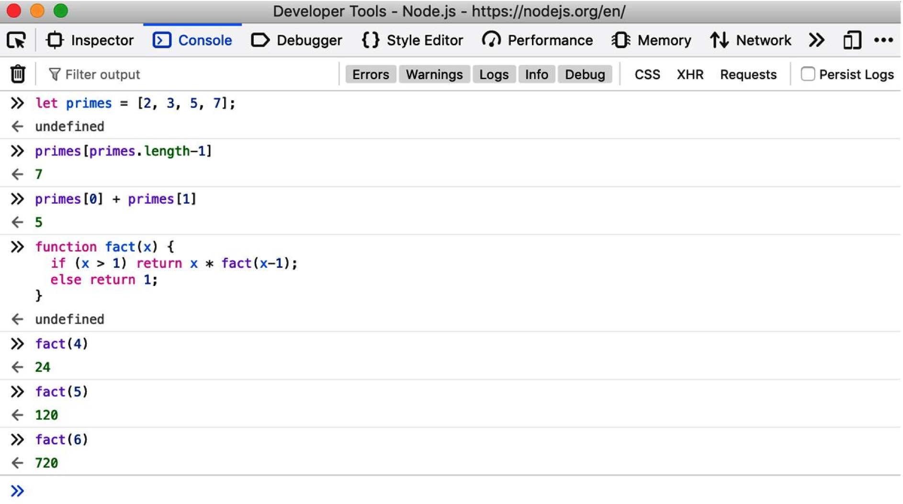
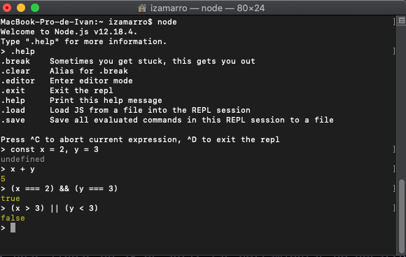

# Introducción a JavaScript

JavaScript (de ahora en adelante abreviado como JS) es el lenguaje de programación de la web. La mayoría de sitios web usan JS, y todos los navegadores modernos, en ordenadores, tablets, telefonos, incluyen interpretes de JS, lo cual hace JS el lenguaje más desplegado de la historia de la programación. En la última decada, Node.js ha permitido llevar JS fuera de los navegadores de una manera satisfactoria, lo que además lo convierte en el lenguaje más usado por los desarrolladores en la historia del software reciente.

JS es un lenguaje de alto nivel, dinamico e interpretado que se lleva bien con los estilos de programación orientada a objetos, así como con la programación funcional. Las variables de JS no requieren un tipado fuerte, aunque existen supersets del lenguaje como TypeScript que habilitan esta característica.

Su sintaxis está ligeramente basada en Java, pero **no tienen nada que ver uno con el otro**. JS deriva sus funciones de primera clase (first-class functions) de Scheme y su herencia está basada en prototipos (prototypes-based inheritance), de un lenguaje poco conocido llamado Self. No es necesario conocer estos dos lenguajes para saber JS.

El nombre de JS a menudo induce a confusión, pensando que tiene algo que ver con el lenguaje de programación Java, pero aparte de esa superficial coincidencia sintactica en algunos aspectos, **JS no tiene nada que ver con Java**. Los origenes de JS fueron como lenguaje de scripting y ha ido evolucionando hasta convertirse en un lenguaje muy eficiente de proposito general, que mantiene bases de código gigantes en proyectos de empresas y personas de todo el planeta.

Para ser útil, todo lenguaje debe tener una plataforma, una librería estandar, para realizar cosas básicas como entradas y salidas. El core de JS define una API mínima para trabajar con números, texto, matrizes, mapas, etc. Pero el core de JS no incluye ninguna funcionalidad de entradas o salidas. Las entradas y salidas, así como funcionalidades más complejas como el manejo de red, almacenamiento o gráficos, son responsabilidad del entorno de ejecución donde JS ha sido embebido (incrustado, implementado ;D).

El entorno de ejecución originad de JS es el navegador web y sigue siendo el entorno de ejecución más común para el código JS. El entorno del navegador permite al código JS desde obtener inputs del ratón o teclado del usuario o realizar solicitudes HTTP. Y permite a JS realizar outputs al usuario mediante HTML y CSS.

Desde 2010, existe otro entorno de ejecución disponible para el código JS. Node brinda a JS la posibilidad de salir de los navegadores y sus APIs y acceder al sistema operativo, permitiendo a JS escribir y leer archivos, enviar y recivir datos sobre la red, y no solo realizar peticiones HTTP sino también atenderlas. Node es una herramienta muy popular para la creación de servidores web y como alternativa para el scripting de utilidades en la terminal.

## JS: Nombres, versiones y modos:

JavaScript se creó en Netscape en los primeros días de la web, y técnicamente, "JavaScript" es una marca comercial con licencia de Sun Microsystems (ahora Oracle) utilizados para describir implementación del lenguaje por parte de Netscape (ahora Mozilla). Netscape envió el idioma para estandarización a ECMA (European Computer Manufaturer's Association), y debido a problemas de marcas registradas, la versión estandarizada del idioma estaba atascada con el extraño nombre "ECMAScript". En ka práctica, todo el mundo simplemente llama al lenguaje JavaScript. Se usa el nombre "ECMAScript" y la abreviatura "ES" para referirse al estándar de idioma y versiones de ese estándar. Durante la mayor parte de la década de 2010, la versión 5 del estándar ECMAScript se ha compatibilizado con todos los navegadores web. Nosotros vamos a estudiar ES5 como el la version de compatibilidad de referencia y no versiones anteriores del lenguaje. ES6 fue lanzado en 2015 y agregó importantes novedades características que incluyen la sintaxis de clases y módulos que cambiaron JavaScript de un lenguaje de secuencias de comandos a un lenguaje serio y de uso general adecuado para la ingeniería de software a gran escala. Desde ES6, la especificación ECMAScript se ha movido a una cadencia de lanzamiento anual, y versiones del idioma ES2016, ES2017, ES2018, ES2019 y ES2020 ahora se identifican por año de lanzamiento. A medida que JavaScript evolucionó, los diseñadores del lenguaje intentaron corregir fallas en las primeras versiones (pre-ES5). Para mantener la retrocompatibilidad, no es posible eliminar funciones heredadas, sin importar que defectuosas sean. Pero en ES5 y versiones posteriores, los programas pueden optar por JavaScript en `'strict mode'`en el que se han cometido corregido muchos de estos errores. En ES6 y posteriores, el uso de nuevas características del lenguaje a menudo invoca implícitamente el`'strict mode'`.

Por ejemplo, si usamos la palabra reservada `class` de ES6 o creamos un módulo ES6, entonces todo el código dentro de la clase o módulo es automáticamente estricto, y las características antiguas y defectuosas no están disponibles en esos contextos.

## Explorando JS

Cuando aprendemos un nuevo lenguaje de programación, es muy importante coger los ejemplos que se nos dan, probarlos, modificarlos y tratar así de ampliar nuestro entendimiento del lenguaje. Para hacer esto, por supuesto, necesitamos un interprete.

La manera más facil de probar unas líneas de JS es abrir las herramientas de desarrollo de tu navegador y seleccionar la tab de la Consola. Ahi podemos incluir código y ver el resultado de lo que escribimos. Muchas veces vienen en forma de paneles estas consolas, pero suele ser posible separarlas en ventanas independientes, lo cual facilita el probar código ;D



La otra forma que tenemos de probar el código JS es bajando Node desde https://nodejs.org. Una vez instalado en nuestro sistema, solo debemos abrir una Terminal y escribir `node` para tener una sesión interactiva de JS.



## Hello World

Escribir código en la consola del navegador on en la terminal de una sesión de Node puede resultar engorroso, y profesionalmente ineficiente. Es mejor que usemos un editor de código como VSCode, WebStorm, etc. Desde ahí si podemo escribir código que despues copiemos y peguemos en las consolas de los navegadores o en una sesión de Node. O lo que es mejor todavía, podemos guardar el código en un archivo JS (su extensión debe ser .js) y despues ejecutarlo con Node:

`$ node archivo.js`

Si usamos Node de esta manera, ahi que tener en cuenta que Node no lo mostrará el resultado por pantalla como en las sesiones, ahi que indicarlo de una manera programatica. Podemos usar la función `console.log()` para mostrar texto y otros valores de JS en la terminal o en la consola del navegador.

---

_Ejercicio:_
_Crea un archivo llamado hello.js que contenga la siguiente linea de codigo:_

```js
console.log("Hello World!");
```

_Ejecutalo con `node hello.js` y deberías ver el mensaje en pantalla_

---

_Ejercicio:_
_Crea un archivo llamado hello.html y pon el siguiente html dentro de él:_

```html
<script src="hello.js"></script>
```

_Despues carga el archivo hello.html en tu navegador y abre la consola de navegación para ver el mensaje en pantalla_

---

## Un poco de JS

```js
// Todo lo que sigue a dos barras es un comentario.
// Lee los comentarios con atención: explican el código JavaScript.
// Una variable es un nombre simbólico para un valor.
// Las variables se declaran con la palabra clave let:

let x; // Declara una variable llamada x.

// Los valores son asignados a las variables con el signo =

x = 0; // Ahora la variable tiene el valor 0

x; // => 0: La variable es evaluada por su valor

// JS soporta varios tipos de de valores

x = 1; // Numeros
x = 0.01; // Los numeros pueden ser enteros o reales
x = "hello world"; // Strings de texto con dobles comillas
x = "js mola"; // Strings de texto con comillas siples
x = true; // Un valor booleano
x = false; // El otro valor booleano
x = null; // representa ausencia de valor
x = undefined; // es otro valor especial como null
```

Los otros 2 tipos importantes que JS puede manipulas son los objetos y los arrays

```js
// El tipo de dato más importante de JS es el objeto
// Un objeto es una colección de pares nombre/valor, o un string a un mapa de valores

let course = {
  // los objetos se encierran entre llaves
  topic: "js", // la propiedad 'topic' tiene el valor "js"
  edition: 14, // la propiedad 'edition' tiene el valor 14
}; // la llave de cierre nos indica el fin del objeto

// Se puede acceder a las propiedades de un objeto con . o []:
course.topic; // => "js"
course["edition"]; // => 14: otra forma de acceso al valor de la propiedad
course.author = "Zamarro"; // Crea una nueva propiedad por asignación
course.contents = {}; // {} es un objeto sin propiedad

// Acceso condicional de las propiedades con ?. (ES2020):
course.contents?.chapters?.section1; // => undefined: course.contents no tiene ninguna propiedad llamada chapters

// JavaScript también admite matrices (listas indexadas numéricamente) de valores:
let primes = [2, 3, 5, 7]; // Una matriz de 4 valores, delimitada con [ ].

primes[0]; // => 2: el primer elemento (índice 0) de la matriz.
primes.length; // => 4: cuántos elementos hay en la matriz.
primes[primes.length - 1]; // => 7: el último elemento de la matriz.
primes[4] = 9; // Agrega un nuevo elemento por asignación.
primos[4] = 11; // O altera un elemento existente por asignación.

let empty = []; // [] es una matriz vacía sin elementos.
empty.length; // => 0

// Las matrices y los objetos pueden contener otras matrices y objetos:
let points = [
  // Una matriz con 2 elementos.
  { x: 0, y: 0 }, // Cada elemento es un objeto.
  { x: 1, y: 1 },
];

let data = {
  // Un objeto con 2 propiedades donde el valor de cada propiedad es una matriz.
  trial1: [
    [1, 2],
    [3, 4],
  ],
  trial2: [
    [2, 3],
    [4, 5],
  ], // Los elementos de las matrices son matrices.
};
```

La sintaxis utilizada para listar elementos de array con los corchetes o mapear las propiedades de un objeto a valores dentro del mismo, son conocidas como expresiones inicializadoras. Una expresion es una frase que JS puede evaluar para producir un valor. Por ejemplo, el uso de `.` y `[]` que se refiere al valor de la propiedad de un objeto o un elemento de un array es una expresión.

Algunas de las expresiones más comunes en JS son los operadores:

```js
// Los operadores actuan sobre valores (los operandos) para producir un nuevo valor
3 + 2; // => 5: adicion
3 - 2; // => 1: substracción
3 * 2; // => 6: multiplicación
3 / 2; // => 1.5: división
points[1].x - points[0].x; // 1 => operadores más complicados tambien funcionan
"3" + "2"; // => "32": + suma numeros y concatena arrays

// JS define algunos abreviaciones para operadores aritmeticos comunes
let count = 0;
count++; // Incrementa la variable
count--; // Decrementa la variable
count += 2; // Suma 2: parecido a hacer count = count + 2;
count *= 3; // Multiplca por 3: parecido a hacer count = count * 3;
count; // => 6: los nombres de las variables son expresiones!!

// Los operadores de igualdad y relacionales prueban si dos valores son iguales,
// desiguales, menor que, mayor que, etc. Evalúan true o false.
let x = 2,
  y = 3; // Estos signos = son asignaciones, no pruebas de igualdad

x === y; // => false: igualdad

x !== y; // => true: desigualdad
x < y; // => true: menor que
x <= y; // => true: menor o igual
x > y; // => false: mayor-que
x >= y; // => false: mayor o igual que
"dos" === "tres"; // => false: las dos cadenas son diferentes
"dos" > "tres"; // => true: " tw "es alfabéticamente mayor que" th "
false === x > y; // => true: false es igual a false

// Los operadores lógicos combinan o invierten valores booleanos

x === 2 && y === 3; // => true: ambas comparaciones son verdaderas. && es AND
x > 3 || y < 3; // => false: ninguna comparación es verdadera. || es OR
!(x === y); // => true: ! invierte un valor booleano
```

Si en JS las expresiones son las frases, entonces los estamentos son como sentencias completas. Vagamente, una expresión es algo que se computa a un valor pero no hace nada: no altera el estado del programa de ninguna manera. Los estamentos, por otra parte, no tienen valor, pero alteran el estado. Todas las declaraciones y asignaciones anteriores son estamentos. La otra categoria de estamentos son las estructuras de control, como los condicionales y los loops.

Una función es un blocke con nombre y parametrizado de codigo JS que se define una sola vez, y puede ser reutilizado invocandolo tantas veces como sea necesario.

```js
// Las functiones son blockes parametrizados de JS que pueden ser invocadas
function plus1(x) {
  // Define una funcion llamada 'plus1' con el parametro 'x'
  return x + 1; // Devuelve el valor con una adicion de 1 al valor pasado a la funcion
} // las funciones se encierran entre llaves

plus1(y); // => 4: y es 3, entonces su invocacion retorna 3 + 1

const square = function (x) {
  // las funciones son valores que pueden ser asignadas
  return x * x;
};

square(plus1(y)); // 16: invoca dos funciones en una sola expresion
```

En ES6 y posteriores, existe un shortcut para la sintaxis de definición de funciones, llamado fat arrow functions. La sintaxis es más concisa y usa `=>` para separar una lista de argumentos del cuerpo de la funcion. Las arrow functions son muy usadas cuando queremos pasar una funcion anonima como argumento de otra funcion:

```js
// en este caso la palabra reservada 'const' define un valor que no puede ser reasignado a diferencia de 'let'
const plus1 = (x) => x + 1;
const square = (x) => x + x;

plus1(y);
square(plus1(y));
```

Cuando usamos funciones con objetos, obtenemos lo que se conocen como metodos:

```js
// Cuando a un objeto le asignamos como propiedad una funcion a estas las llamamos metodos.
// Todos los objetos JS (incluyendo arrays) tienen metodos

let a = [];
a.push(1, 2, 3); // el metodo pus() añade elementos al array
a.reverse(); // el metodo reverse, invierte el array

// Podemos definir nuestros propios metodos.
// La palabra 'this' se refiere al objeto donde el propio metodo esta definido

points.dist = function () {
  // definimos un metodo que calcula la distancia entre puntos
  const p1 = this[0]; // primer elemento del array que estamos invocando
  const p2 = this[1]; // segundo elemento de ese 'this' objeto
  const a = p2.x - p1.x; // diferencia en x de las coordenadas
  const b = p2.y - p1.y; // diferencia en y de las coordenadas

  /*
  Retornamos el teorema de Pitágoras:

  El teorema de Pitágoras establece que, en todo triángulo rectángulo, 
  la longitud de la hipotenusa es igual a la raíz cuadrada de la suma del área de los cuadrados 
  de las respectivas longitudes de los catetos
  */

  return Math.sqrt(a * a + b * b); // Math.sqrt() calcula el la raiz cuadrada
};

points.dist();
```

JS también incluye condiciones y loops:

```js
// La sintaxis de JS para los estamentos de condicionales y loops es muy parecida a la de otros lenguajes como
// C, Java, Python, etc.

function abs(x) {
  // Una función para calcular el valor absoluto.
  if (x >= 0) {
    // La sentencia if ...
    return x; // ejecuta este código si la comparación es verdadera.
  } /* Este es el final de la cláusula if. */ else {
    // La cláusula else opcional ejecuta su código si la comparación es falsa.
    return x;
  } // Las llaves son opcionales cuando hay 1 declaración por cláusula.
} // Observa las declaraciones de retorno anidadas dentro de if / else.
abs(10) === abs(10); // => true

function sum(array) {
  // Calcula la suma de los elementos de una matriz
  let sum = 0; // Comienza con una suma inicial de 0.
  for (let x of array) {
    // Haz un bucle sobre la matriz, asignando cada elemento a x.
    sum += x; // Agrega el valor del elemento a la suma.
  } // Este es el final del ciclo.
  return sum; // Devuelve la suma.
}

suma(primes); // => 28: suma de los primeros 5 primos 2 + 3 + 5 + 7 + 11

function factorial(n) {
  // Una función para calcular factoriales
  let product = 1; // Comienza con un producto de 1
  while (n > 1) {
    // Repite las declaraciones en {} mientras expr in () es true
    product *= n;
    n--;
  } // Fin del ciclo
  return product; // Devuelve el producto
}

factorial(4); // => 24: 1 * 4 * 3 * 2

function factorial2(n) {
  let product = 1;
  for (let i = 2; i <= n; i++) {
    product *= i;
  }
  return product;
}

factorial(5); // => 120: 1*2*3*4*5
```

JS tambuen soporta el estilo de programación orientada a objetos, pero es un poco diferente a la programación orientada a objetos de otros lenguajes debido a su nacimiento como lenguaje que implementa la herencia de prototipos. En ES6 se incluyeron las clases `class` como azucar sintactico sobre las funciones, para darle un estilo a la sintaxis más parecido al de otros lenguajes.

```js
class Point {
  // Por convencion el nombre de las clases debe ser capitalizado
  constructor(x, y) {
    // La funcion de construccion inicializa nuevas instancias
    this.x = x; // guardamos los argumentos de la funcion en propiedades del objeto
    this.y = y;
    // no es necesario retornar nada desde el constructor
  }

  distance() {
    return Math.sqrt(this.x * this.x + this.y * this.y);
  }
}

// Usamos la funcion del constructor de Point() con 'new' para crear objetos Point
const p = new Point(1, 1);
// Ahora podemos usar los metodos de Point sobre el objeto p
p.distance();
```
