# GIT Practico

_Git es un software de control de versiones diseñado por Linus Torvalds, pensando en la eficiencia y la confiabilidad del mantenimiento de versiones de aplicaciones cuando éstas tienen un gran número de archivos de código fuente. Su propósito es llevar registro de los cambios en archivos y coordinar el trabajo que varias personas realizan sobre archivos compartidos._

Entre sus características, encontramos que nos genera un historico de nuestro trabajo, permitiendo revertir binarios a un estado anterior o incluso un proyecto entero. A su vez nos permite comparar los cambios o diferencias entre versiones anteriores del binario, ver quien lo modifico o incluso colaborar con varias personas que actuan sobre el mismo binario.

La gran ventaja de ser un sistema de control de versiones distribuido, es que al no depender de una base de datos centralizada, cualquiera puede recrear el arbol de cambios, ya que cada cliente replica completamente el repositorio. La realidad es que cada vez que descargamos una instantánea del mismo, estamos haciendo una copia de seguridad completa de todos los datos. Esto en la práctica diaria de los equipos de desarrollo de software permite establecer flujos de trabajo descentralizados, realizando instantaneas llamadas `commits` que suben a un repositorio remoto.

Tu repositorio local esta dividido en tres arboles mantenidos por git:

- Working Directory: que contiene los archivos en el estado actual
- Index: el area de staging, una coleccion de archivos que van a ser guardados como instantanea
- Head: los archivos trackeados en local y donde apunta el ultimo commit

Por otra parte:

- El repositorio remoto, donde enviamos y recibimos las instantaneas a un servidor GIT que mantiene el historico de cambios.

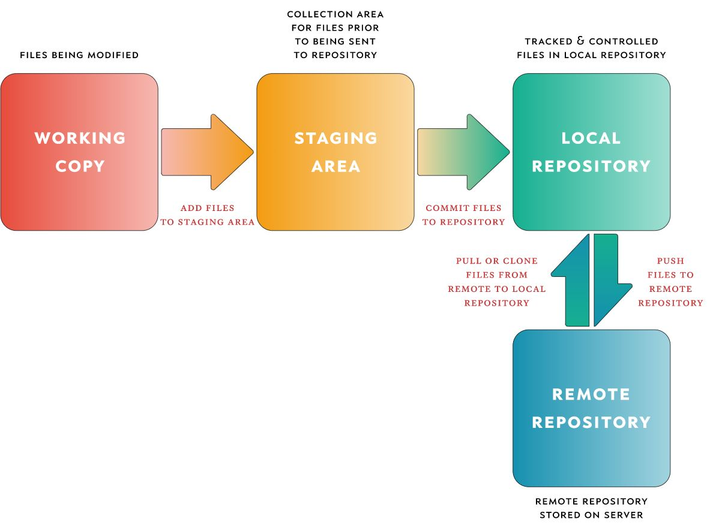

## Instalar GIT

- OSX: https://git-scm.com/download/mac
- WINDOWS: http://msysgit.github.io/
- LINUX: https://git-scm.com/book/en/v2/Getting-Started-Installing-Git

Podemos comprobar la version que tenemos de git lanzando el comando `git --version`

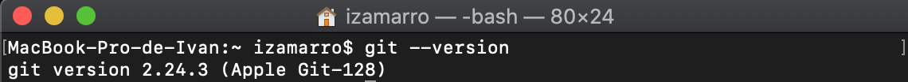

Una vez instalados tendremos en los sitemas basados en UNIX un archivo de configuración global en nuestra home, llamado `.gitconfig`

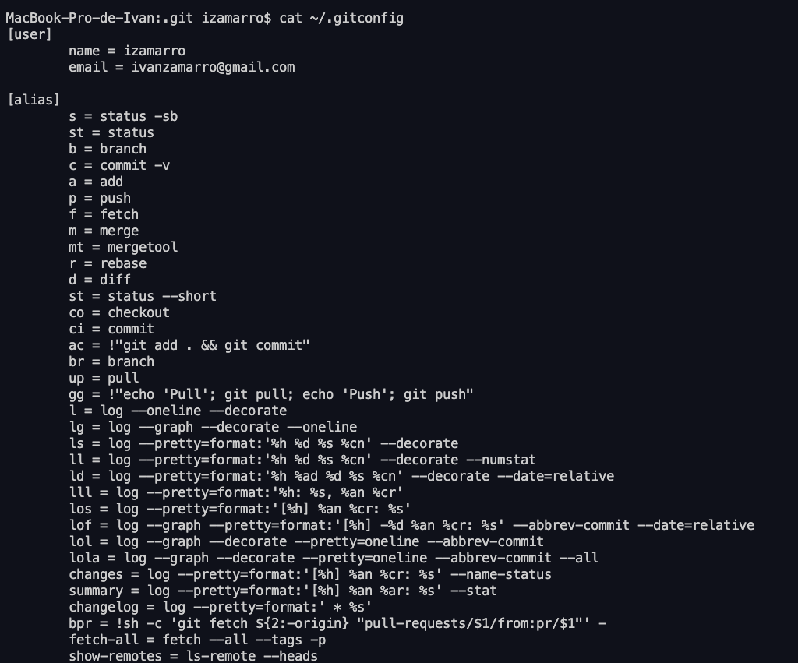

Que contiene configuraciones que se aplican a todos los repositorios que inicializemos.

## Comandos básicos explicados

### Inicialización de un repositorio

Una vez creado un proyecto de código, inicializaremos el repositorio con `git init`. Esto creará una carpeta en nuestro proyecto llamada `.git` que contiene la configuración y trackeo de los archivos.

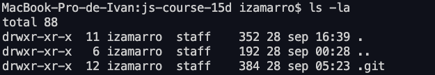

En esta carpeta encontraremos diversos archivos, siendo el `config` el más superlativo para nosotros.

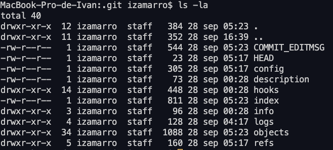

---

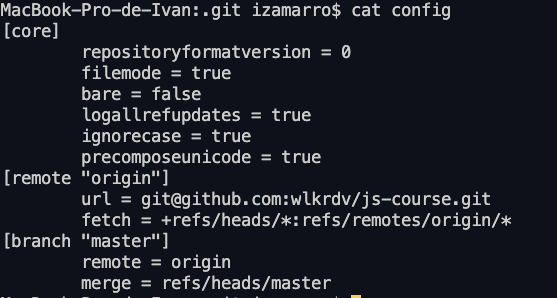

### Clonando un repositorio

Podemos crear una copia local de un repositorio local con el comando `git clone /path/al/repositorio` o bien de un repositorio remoto con ` git clone username@host:/path/al/repositorio`, esto clonara el repositorio remoto en nuestro disco duro.

### Añadir y comitear

Una vez realizados los cambios en nuestro sistema de archivos, podemos proponer dichos cambios como commit.
Para ello tenemos que añadirlos al area de `Index` o `staging` usando `git add <filename>` o podemos usar `git add *` _(Esto se considera mala practica, al inicio, si no tenemos cuidado podemos incluir archivos que no deseamos)_.

Este es el primer paso del flujo de git. Ahora solo nos queda guardar la instantanea con `git commit -m "Mensaje del commit"`. Una vez hecho nuestros archivos han sido commiteados al `HEAD` pero no al repositorio remoto todavia, sino en nuestra copia local.

### Enviando los cambios y añadiendo un remoto

Nuestros cambios se encuentran en el `HEAD` de nuestra copia local, para enviarlos al repositorio remoto, ejecutemos `git push origin <branch name>` _(Nombre de la rama al que quieras commitear)_.

Si por cualquier razon no tuvieramos el repositorio clonado, y queremos conectarl al servidor remoto un repositorio existente ya en local, solo tenemos que añadirlo: `git remote add <origin> <server>` _(Nombre del repositorio para git)_

Y ya estariamos listos para enviar los cambios.

### Creando ramas

Las ramas son usadas para desarrollar nuevas caracteristicas en el software de manera aislada unas de otras. La rama `master` es la rama por defecto cuando creamos un repositorio. Usa otras ramas para el desarrollo y unelas a la rama master cuando hayas completado la nueva característica en la que estas trabajando.

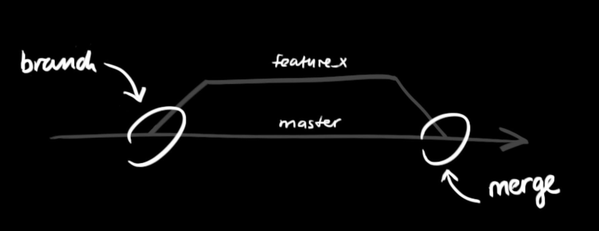

Podemos crear una nueva rama desde el punto en el que nos encontramos con `git checkout -b <branch name>` y podemos volver a la rama `master` en cualquier momento con `git checkout master`.

Tambien podemos borrar ramas: `git branch -d <nombre de la rama a borrar>`.
Una rama no estará disponible a otros a menos que la publiquemos al repositorio remoto: `git push origin <branch name>`

### Actualizacion y union (update & merge)

Para actualizar tu repositorio local con los ultimos cambios, commits, usaremos `git pull` lo cual traera y unira los cambios que difieran en nuestra rama local. Si deseas unir una rama ya existente en la que tienes activa, por ejemplo `master`, usaremos `git merge <branch name to merge>`.

En ambos casos git intentara auto unir los cambios. Desgraciadamente esto no siempre es posible, y encontraremos ocasiones en las que git encontrará conflictos. Cada desarrollador es responsable de resolver los conflictos de manera manual, una vez resueltos los conflictos sobre los archivos marcados por git, los añadiremos al `Index` para marcarlos como unidos. `git add <filename with conflicts resolved>`.

Si te interesa ver los cambios, aunque los sistemas de edicion de codigo actuales son capaces de mostrarlos de una manera comoda, en git puedes ver la difrencia entre cambios, como los conflictos resueltos, con: `git diff <source_branch> <target_branch>`

### Tagging

Es recomendable que creemos tags de las versiones de software que liberamos, podemos crear tags, por ejemplo: v1.0.0 con `git tag 1.0.0 <optional tagged commit>` o sobre el commit actual `git tag <tag name>`.

Como versionar:

- La versión patch Z (x.y.Z | x > 0) DEBE incrementarse cuando se introducen solo arreglos compatibles con la versión anterior. Un arreglo de bug se define como un cambio interno que corrige un comportamiento erróneo.

- La versión minor Y (x.Y.z | x > 0) DEBE ser incrementada si se introduce nueva funcionalidad compatible con la versión anterior. Se DEBE incrementar si cualquier funcionalidad de la API es marcada como deprecada. PUEDE ser incrementada si se agrega funcionalidad o arreglos considerables al código privado. Puede incluir cambios de nivel patch. La versión patch DEBE ser reseteada a 0 cuando la versión minor es incrementada.

- La versión major X (X.y.z | X > 0) DEBE ser incrementada si cualquier cambio no compatible con la versión anterior es introducida a la API pública. PUEDE incluir cambios de niver minor y/o patch. Las versiones patch y minor DEBEN ser reseteadas a 0 cuando se incrementa la versión major.

### Reemplazando cambios locales

En el caso de que algo fuera mal, aunque sabemos que nadie mete la pata xD, puedes reemplazar los cambios locales usando `git checkout -- <filename>`, esto reemplazara los cambios en el area de `WORKING`, con el ultimo contenido que estuviera en el `HEAD`. Cualquier contenido añadido al `INDEX` se preserva.

Si quisieras tirar todos los cambios y volver a un punto anterior, podemos traernos todo el historico con `git fetch origin` y reiniciar al punto que deseemos `git reset --hard origin/master` o cualquier commit `git reset --hard <hash del commit>`.

## Flujo de trabajo Github

Algunos equipos siguen complicados flujos de trabajo como el de GitFlow. En este flujo basado en multiples ramas:

- Master: Es la rama (branch o trunk) principal que tiene la última versión productiva del código.
- Release: Es la rama que contiene los nuevos features terminados que se van desarrollando para el siguiente lanzamiento (release) de forma que al iniciar uno nuevo puedas descargar todos los anteriores por si tienen alguna dependencia.
- Develop: Es la rama que contiene las características (features) en desarrollo en una iteración, esta rama será posteriormente parte de Release mediante un pull request.
- Feature: Es la rama que contiene el feature en el que estás trabajando personalmente (varios desarrolladores pueden trabajar en un feature), éste debe ser enviado a develop mediante un full request, por lo general aprobado por el líder técnico.
- Hotfix: Es la rama que contiene cambios urgentes sobre master que permiten corregir un bug o resolver un error, éste debe ser enviado a master y se debe notificar a todos los desarrolladores para que puedan actualizar sus ramas.

---

El flujo de GitHub es un flujo de trabajo ligero basado en ramas que admite equipos y proyectos en los que se realizan implementaciones con regularidad.

Está basado en cuatro principios:

- Todo lo que está en la rama master está listo para ser puesto en producción
- Para trabajar en algo nuevo, debes crear una nueva rama de master con un nombre descriptivo (por ejemplo: integracion-oauth)
- Al necesitar ayuda o querer integrar el trabajo hacia la rama principal se debe abrir una pull request (solicitud de integración de cambios)
- Alguien debe revisar y visar los cambios para fusionarlos con la rama master
- Los cambios integrados se pueden poner en producción

### Creación de una rama

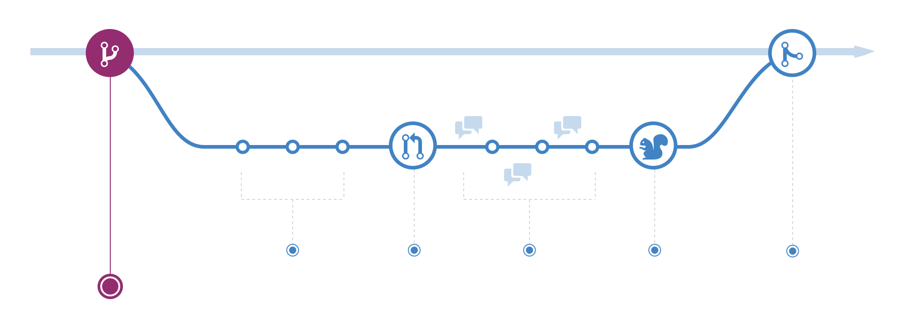

Cuando estés trabajando en un proyecto, tendrás un montón de características o ideas diferentes en progreso en un momento dado, algunas de las cuales están listas para funcionar y otras no. La ramificación existe para ayudarnos a administrar este flujo de trabajo.

Cuando creas una rama en tu proyecto, estás creando un entorno en el que puedes probar nuevas ideas. Los cambios que realizas en una rama no afectan a la rama principal, por lo que puedes experimentar y realizar cambios, con la seguridad de saber que tu rama no se fusionará hasta que esté lista para ser revisada por alguien con quien esté colaborando.

_**Consejo**: La ramificación es un concepto central en Git, y todo el flujo de GitHub se basa en él. Solo hay una regla: cualquier elemento de la rama `master` siempre se puede desplegar._

_Debido a esto, es extremadamente importante que tu nueva rama se cree fuera de master cuando se trabaja en una función o una solución. El nombre de tu rama debe ser descriptivo (por ejemplo, refactor-authentication, user-content-cache-key, make-retina-avatars), para que otros puedan ver en qué se está trabajando._

### Añadiendo commits

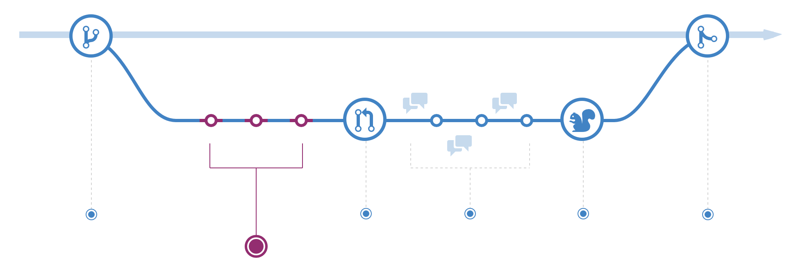

Una vez que se ha creado la rama, es hora de comenzar a hacer cambios. Siempre que agregues, edites o elimines un archivo, estás realizando un commit y agregándolos a su rama. Este proceso de agregar commits realiza un seguimiento de tu progreso mientras trabajas en una rama de nuevas funciones.

_**Consejo:** Los commits también crean un historial transparente de tu trabajo que otros pueden seguir para comprender lo que has hecho y por qué. Cada commit tiene un mensaje de commit asociado, que es una descripción que explica por qué se realizó un cambio en particular. Además, cada commit se considera una unidad de cambio separada. Esto te permite revertir los cambios si se encuentra un error o si decide ir en una dirección diferente._

_Los mensajes de commit son importantes, especialmente porque Git rastrea sus cambios y luego los muestra como commits una vez que se envían al servidor. Al escribir mensajes de commit claros, puedes facilitar que otras personas lo sigan y den sus comentarios._

### Abrir una Pull Request

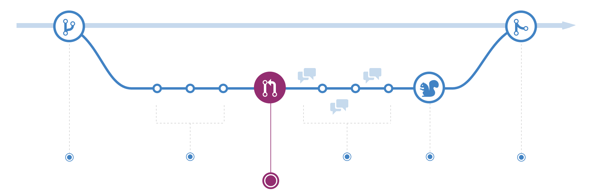

Las pull requests inician la discusión sobre tus commits. Debido a que están estrechamente integrados con el repositorio de Git subyacente, cualquiera puede ver exactamente qué cambios se fusionarían si aceptaran su solicitud.

Puedes abrir una pull request en cualquier momento durante el proceso de desarrollo: cuando tienes poco o ningún código pero quieres compartir algunas capturas de pantalla o ideas generales, cuando estás atascado y necesitas ayuda o consejo, o cuandos está listo para que alguien para revise tu trabajo. Al usar el sistema `@mention` de GitHub en tu mensaje de Pull Request, puedes solicitar comentarios de personas o equipos específicos, ya sea que se encuentren al final del pasillo o a diez zonas horarias de distancia.

_**Consejo:** Las pull requests son útiles para contribuir a proyectos de código abierto y para administrar cambios en repositorios compartidos. Si estás utilizando un modelo de fork y pull, las pull requests brindan una forma de notificar a los encargados del mantenimiento del proyecto sobre los cambios que deseas que consideren. Si estás utilizando un modelo de repositorio compartido, las pull requests ayudan a iniciar la revisión del código y la conversación sobre los cambios propuestos antes de que se fusionen en la rama principal._

### Discussion y revisión del código

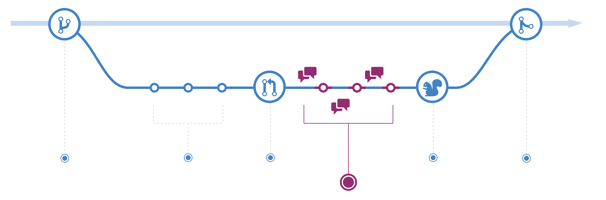

Una vez que se ha abierto una pull request, la persona o el equipo que revisa tus cambios puede tener preguntas o comentarios. Quizás el estilo de codificación no coincide con las pautas del proyecto, al cambio le faltan pruebas unitarias o tal vez todo se ve bien y todo está en orden. Las pull requests están diseñadas para fomentar y capturar este tipo de conversaciónes.

También puedes continuar haciendo push a tu rama mientras se debate y recibir comentarios sobre los commits. Si alguien comenta que se te olvidó hacer algo o si hay un error en el código, puedes solucionarlo en su rama e pushear el cambio. GitHub mostrará tus nuevos commits y cualquier comentario adicional que pueda recibir en la vista Pull Request unificada.

_**Consejo:** Los comentarios de una pull request se escriben en markdown, por lo que puedes incluir imagenes, emoji o textos de codigo incrustado_

### Despliegue

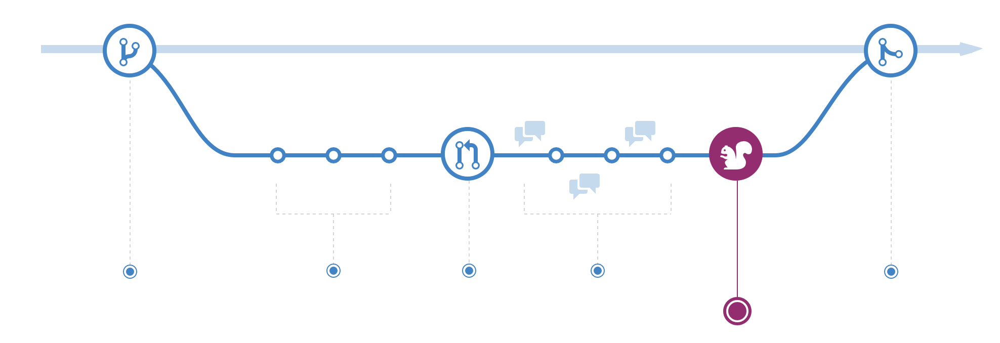

Con Github se puede desplegar una rama en para el testeo final en producción, antes de mergearla a la rama principal.
Una vez que una pull request ha sido revisada y la rama pasa los tess, puedes desplegaar tus cambios para verificarlos en producción y si por casualidad la rama diese problemas, podemos volver hacia atras desplegando la rama principal en produccion.

La estrategia de despliegue depende del equipo, pero lo normal es desplegar las pull requests en un entorno de staging especial para ello.

### Mergeando

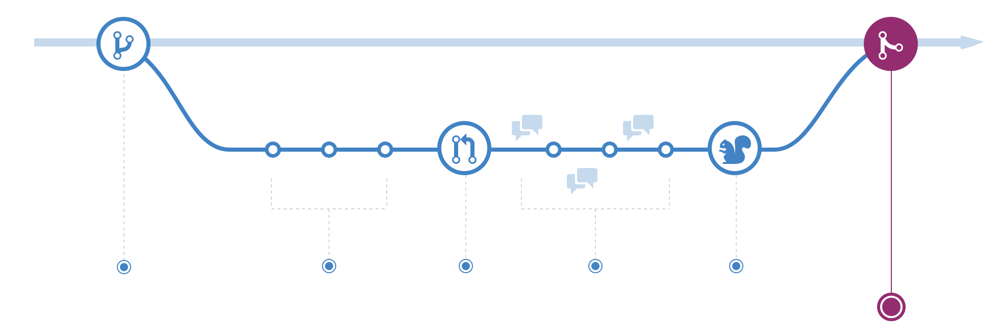

Una vez los cambios han sido verificados, es momento de mergear el codigo a la rama principal. Una vez mergeado, las pull requests serviran de historico de los cambios y de la conversación, permitiendo a los demas entender la decisión que llevo a introducirla.
